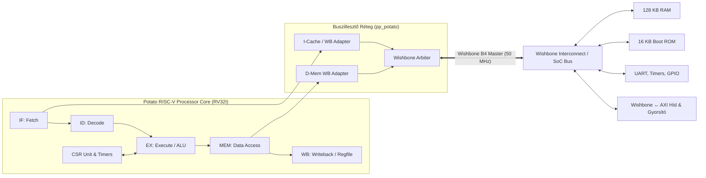
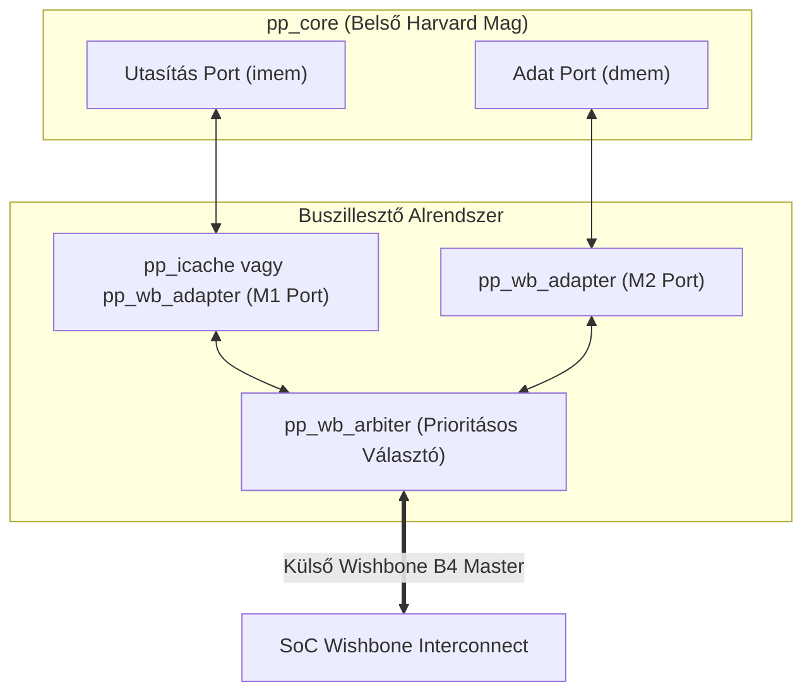

# Potato RISC-V Soft-Core Processzor – Rendszer- és Architektúra Dokumentáció

## Diplomamunka: RISC-V Soft-Core + AXI Hardveres Gyorsító Integrációja Xilinx FPGA-n
**Célplatform:** Xilinx Artix-7 FPGA (`xc7a35tcsg324-1`) · **EDA:** Vivado ML Standard 2023.2 · **Nyelv:** VHDL (IEEE 1164/NUMERIC_STD) & Bare-metal C / Asm

---

## Tartalomjegyzék
1. [Bevezetés és Rendszerkontextus](#1-bevezetés-és-rendszerkontextus)
2. [Fő Jellemzők és Specifikációk](#2-fő-jellemzők-és-specifikációk)
3. [A Processzormag 5 Fokozatú Futószalag Architektúrája (Pipeline)](#3-a-processzormag-5-fokozatú-futószalag-architektúrája-pipeline)
   - [3.1. Utasításbeolvasási fokozat (Instruction Fetch – IF)](#31-utasításbeolvasási-fokozat-instruction-fetch--if)
   - [3.2. Utasításdekódolási fokozat (Instruction Decode – ID)](#32-utasításdekódolási-fokozat-instruction-decode--id)
   - [3.3. Végrehajtási fokozat (Execute – EX)](#33-végrehajtási-fokozat-execute--ex)
   - [3.4. Memóriahozzáférési fokozat (Memory Access – MEM)](#34-memóriahozzáférési-fokozat-memory-access--mem)
   - [3.5. Visszaírási fokozat (Writeback – WB)](#35-visszaírási-fokozat-writeback--wb)
4. [Adatütközés-kezelés és Adattovábbítás (Hazard Handling & Forwarding)](#4-adatütközés-kezelés-és-adattovábbítás-hazard-handling--forwarding)
5. [Regisztertár (Register File)](#5-regisztertár-register-file)
6. [CSR (Control and Status Registers) és Kivételkezelő Rendszer](#6-csr-control-and-status-registers-és-kivételkezelő-rendszer)
   - [6.1. Támogatott CSR regiszterek térképe](#61-támogatott-csr-regiszterek-térképe)
   - [6.2. Megszakítási architektúra és prioritások](#62-megszakítási-architektúra-és-prioritások)
   - [6.3. Trap / Kivételkezelési ciklus és MRET](#63-trap--kivételkezelési-ciklus-és-mret)
7. [Memória Alrendszer és Buszillesztés](#7-memória-alrendszer-és-buszillesztés)
   - [7.1. Utasítás-gyorsítótár (Instruction Cache – I-Cache)](#71-utasítás-gyorsítótár-instruction-cache--i-cache)
   - [7.2. Wishbone Adapter és Wishbone Arbiter](#72-wishbone-adapter-és-wishbone-arbiter)
   - [7.3. Wishbone B4 Master buszinterfész](#73-wishbone-b4-master-buszinterfész)
8. [SoC Szintű Integráció (Top-Level felépítés)](#8-soc-szintű-integráció-top-level-felépítés)
   - [8.1. Órajel- és reset hálózat](#81-órajel--és-reset-hálózat)
   - [8.2. Memóriatérkép és címdekódolás](#82-memóriatérkép-és-címdekódolás)
   - [8.3. Perifériák (Timer0/1, UART0/1, GPIO, Interconnect)](#83-perifériák-timer01-uart01-gpio-interconnect)
9. [Szoftveres Eszközlánc, Boot Folyamat és C Programozás](#9-szoftveres-eszközlánc-boot-folyamat-és-c-programozás)
   - [9.1. GCC Eszközlánc és ABI](#91-gcc-eszközlánc-és-abi)
   - [9.2. Rendszerindítás (`start.S`) és Linker konfiguráció](#92-rendszerindítás-starts-és-linker-konfiguráció)
   - [9.3. Hardverközeli C függvénykönyvtár (`potato.h`, `libsoc`)](#93-hardverközeli-c-függvénykönyvtár-potatoh-libsoc)
10. [Verifikáció, Szimuláció és Erőforrás-mérési Eredmények](#10-verifikáció-szimuláció-és-erőforrás-mérési-eredmények)
11. [Összegzés és Kapcsolódás a Hardveres Gyorsítóhoz](#11-összegzés-és-kapcsolódás-a-hardveres-gyorsítóhoz)

---

## 1. Bevezetés és Rendszerkontextus

A projekt központi vezérlőegysége a nyílt forráskódú, VHDL nyelven kifejlesztett **Potato processzormag** (eredeti szerző: *Kristian Klomsten Skordal*). A Potato egy teljes értékű, szintetizálható 32 bites RISC-V soft-core mikroprocesszor, amelyet kifejezetten FPGA eszközökhöz terveztek.

A diplomamunka célja egy heterogén számítási rendszer megvalósítása, amelyben:
1. A **Potato RV32I soft-core** látja el az általános felügyeleti, kommunikációs (UART), adat-előkészítési, vezérlési és cikluspontos mérési feladatokat.
2. Egy dedikált, VHDL-ben megvalósított **AXI4-Lite / AXI4-Stream fixpontos mátrixszorzó hardveres gyorsító** végzi az intenzív matematikai műveleteket.
3. A processzor és a gyorsító közötti együttműködés Wishbone $\leftrightarrow$ AXI hídrendszeren, memóriába képezett streaming FIFO-kon és megszakítási (IRQ) vonalon valósul meg.



---

## 2. Fő Jellemzők és Specifikációk

| Paraméter | Érték / Megvalósítás | Megjegyzés |
| :--- | :--- | :--- |
| **ISA Architektúra** | RISC-V RV32I Base Integer ISA v2.0 | 32 bites utasítások és regiszterek, lebegőpont és hardveres szorzó nélkül |
| **Privileged Architektúra** | Machine-mode (M-mode) részleges v1.10 | Trap-kezelés, mie, mip, mstatus, mepc, mcause, mtvec, mscratch |
| **Futószalag Mélysége** | 5 fokozat (Fetch, Decode, Execute, Memory, Writeback) | Klasszikus RISC architektúra, 1 ciklus/utasítás ideális áteresztőképesség |
| **Órajelfrekvencia (SoC)**| 50.0 MHz (Artix-7 FPGA-n) | 100 MHz bejövő órajelből Xilinx MMCM állítja elő |
| **Rendszerbusz** | Wishbone Specifikáció B4 (Master) | 32 bites cím- és adatbusz, bájtos granularitás |
| **Belső Buszok** | Harvard architektúra (külön IF és MEM adatút) | A magon belül párhuzamos, az arbiterben közösített |
| **Gyorsítótár (I-Cache)**| Direkt leképzésű (Direct-Mapped) I-Cache | Opcionális (konfigurálható sorméret és sorszám); jelenleg kikapcsolt állapotban fut a determinisztikus késleltetésért |
| **Általános Regisztertár**| 32 db 32 bites regiszter (`x0`–`x31`) | `x0` konstans 0; 2 szinkron olvasóport, 1 szinkron íróport |
| **Megszakítási Vonalak** | 8 egyedileg engedélyezhető külső IRQ (`irq[7:0]`) + Belső Szoftveres és Időzítő IRQ | Hardveres gyorsító a **`IRQ 5`** vonalra kötve |
| **Beépített Időzítők** | 64 bites `cycle`, `time`, `instret` + 32 bites `mtime`/`mtimecmp` | Cikluspontos benchmark méréshez közvetlenül elérhető |
| **Forráskód Nyelve** | Tiszta VHDL (IEEE `std_logic_1164`, `numeric_std`) | Nincsenek gyártóspecifikus primitívek a processzormagban; maximálisan hordozható |

---

## 3. A Processzormag 5 Fokozatú Futószalag Architektúrája (Pipeline)

A mag a klasszikus Hennessy–Patterson-féle 5 fokozatú futószalagot implementálja, kiegészítve elágazás-becslés nélküli, de azonnali ugrásérzékeléssel és intelligens adattovábbítással.

```
       CLK 1        CLK 2        CLK 3        CLK 4        CLK 5
   +------------+------------+------------+------------+------------+
1. |  IF: Fetch | ID: Decode | EX: Exec   | MEM: Memory| WB: Write  |
   +------------+------------+------------+------------+------------+
2.              |  IF: Fetch | ID: Decode | EX: Exec   | MEM: Memory|
                +------------+------------+------------+------------+
3.                           |  IF: Fetch | ID: Decode | EX: Exec   |
                             +------------+------------+------------+
```

### 3.1. Utasításbeolvasási fokozat (Instruction Fetch – IF)
- **Fájl:** [`pp_fetch.vhd`](file:///D:/RISC-V-Soft-Core-AXI-Hardware-Accelerator-Thesis/vendor/potato/src/pp_fetch.vhd)
- **Feladata:** A program számláló (Program Counter – `PC`) nyilvántartása, a következő utasításcím előállítása és a memóriabusz kérés (`imem_req`, `imem_ack`) vezérlése.
- **Következő PC (`pc_next`) prioritási logikája:**
  1. **Kivétel (`exception = '1'`):** A PC azonnal az `evec` (a CSR egység által szolgáltatott `mtvec`) címre ugrik.
  2. **Elágazás vagy Ugrás (`branch = '1'`):** A PC az EX fázisban kiszámított `branch_target` értékét veszi fel.
  3. **Normál léptetés (`imem_ack = '1'` és `stall = '0'`):** $PC_{next} = PC + 4$.
  4. **Stall vagy várakozás:** $PC_{next} = PC$.
- **`cancel_fetch` áramkör:** Ha egy ugrás vagy kivétel akkor következik be, amikor az előző memóriahozzáférés nyugtázása (`imem_ack`) még várat magára, a modul aktiválja a `cancel_fetch` regisztert. Ez biztosítja, hogy a buszról megkésve beérkező régi utasítás érvénytelenítésre kerüljön és ne fusson le hibásan a csővezetékben.

### 3.2. Utasításdekódolási fokozat (Instruction Decode – ID)
- **Fájlok:** [`pp_decode.vhd`](file:///D:/RISC-V-Soft-Core-AXI-Hardware-Accelerator-Thesis/vendor/potato/src/pp_decode.vhd), [`pp_imm_decoder.vhd`](file:///D:/RISC-V-Soft-Core-AXI-Hardware-Accelerator-Thesis/vendor/potato/src/pp_imm_decoder.vhd), [`pp_control_unit.vhd`](file:///D:/RISC-V-Soft-Core-AXI-Hardware-Accelerator-Thesis/vendor/potato/src/pp_control_unit.vhd)
- **Feladata:** A beérkező 32 bites gépi utasítás felbontása, az azonnali értékek kibontása és a vezérlőjelek előállítása.
- **Utasításmezők kinyerése:**
  - `rs1_addr <= instruction(19 downto 15)`
  - `rs2_addr <= instruction(24 downto 20)`
  - `rd_addr  <= instruction(11 downto 7)`
  - `shamt    <= instruction(24 downto 20)`
  - `funct3   <= instruction(14 downto 12)`
- **Azonnali érték dekódoló (`pp_imm_decoder`):** A RISC-V szabvány szerinti formátumok 32 bites előjelhelyes kiterjesztése:
  - **I-típus** (pl. `ADDI`, `LW`): `instr(31..20)`
  - **S-típus** (pl. `SW`): `instr(31..25) & instr(11..7)`
  - **B-típus** (feltételes elágazások): `instr(31) & instr(7) & instr(30..25) & instr(11..8) & '0'`
  - **U-típus** (`LUI`, `AUIPC`): `instr(31..12) & 12 db '0'`
  - **J-típus** (`JAL`): `instr(31) & instr(19..12) & instr(20) & instr(30..21) & '0'`
- **Vezérlőegység (`pp_control_unit`):** Generálja az ALU műveleti kódját, a regiszter-írás engedélyezését (`rd_write`), az elágazás jellegét (`branch_type`), a memóriaművelet jellegét (`LOAD`, `STORE`, `BYTE`, `HALFWORD`, `WORD`), a CSR írás módját, és észleli az érvénytelen műveleteket (`decode_exception`).

### 3.3. Végrehajtási fokozat (Execute – EX)
- **Fájlok:** [`pp_execute.vhd`](file:///D:/RISC-V-Soft-Core-AXI-Hardware-Accelerator-Thesis/vendor/potato/src/pp_execute.vhd), [`pp_alu.vhd`](file:///D:/RISC-V-Soft-Core-AXI-Hardware-Accelerator-Thesis/vendor/potato/src/pp_alu.vhd), [`pp_alu_control_unit.vhd`](file:///D:/RISC-V-Soft-Core-AXI-Hardware-Accelerator-Thesis/vendor/potato/src/pp_alu_control_unit.vhd), [`pp_alu_mux.vhd`](file:///D:/RISC-V-Soft-Core-AXI-Hardware-Accelerator-Thesis/vendor/potato/src/pp_alu_mux.vhd), [`pp_comparator.vhd`](file:///D:/RISC-V-Soft-Core-AXI-Hardware-Accelerator-Thesis/vendor/potato/src/pp_comparator.vhd), [`pp_csr_alu.vhd`](file:///D:/RISC-V-Soft-Core-AXI-Hardware-Accelerator-Thesis/vendor/potato/src/pp_csr_alu.vhd)
- **Feladata:** A műveletek elvégzése, címképzés, feltételvizsgálat, ugrási címek meghatározása és a periféria/memória kérések indítása.
- **ALU (`pp_alu`):** Tisztán kombinációs egység, amely az alábbi műveleteket hajtja végre:
  - Logikai: `AND`, `OR`, `XOR`
  - Aritmetikai: `ADD`, `SUB`
  - Relációs: `SLT` (előjeles kisebb), `SLTU` (előjeltelen kisebb)
  - Léptető: `SLL` (logikai balra), `SRL` (logikai jobbra), `SRA` (aritmetikai jobbra)
  > [!IMPORTANT]
  > A Potato ALU **nem tartalmaz hardveres szorzó- és osztóegységet (RV32M)**. Minden matematikai szorzást szoftveresen (több tíz/száz ciklusos bitenkénti léptető algoritmussal) végez el. Ezért nyújt a diplomamunkában megépülő AXI mátrixszorzó hardveres gyorsító **több mint 10-50-szeres gyorsulást**!
- **Elágazás-kiértékelő komparátor (`pp_comparator`):**
  - Közvetlenül a továbbított (forwarded) `rs1` és `rs2` értékeket hasonlítja össze a `funct3` alapján: `BEQ`, `BNE`, `BLT`, `BGE`, `BLTU`, `BGEU`.
- **Ugrási célcím számítás:**
  - `JAL` és feltételes ágak: $PC + \text{Immediate}$
  - `JALR`: $RS1_{forwarded} + \text{Immediate}$
  - `MRET` / `SRET`: a `csr_value` (vagyis az elmentett `mepc`) értéke.
- **Címigazítás ellenőrzés (Misalignment Check):**
  - Utasítás: ha az ugrási cél alsó két bitje nem `00` $\rightarrow$ `CSR_CAUSE_INSTR_MISALIGN`.
  - Adat: fél szónál `alu_result(0) /= '0'`, szónál `alu_result(1 downto 0) /= "00"` $\rightarrow$ `CSR_CAUSE_LOAD_MISALIGN` / `CSR_CAUSE_STORE_MISALIGN`.

### 3.4. Memóriahozzáférési fokozat (Memory Access – MEM)
- **Fájl:** [`pp_memory.vhd`](file:///D:/RISC-V-Soft-Core-AXI-Hardware-Accelerator-Thesis/vendor/potato/src/pp_memory.vhd)
- **Feladata:** Az adatmemória kérések menedzselése és a beolvasott adatok formázása.
- **Beolvasott adatok konverziója (`rd_data_mux`):**
  - `LB`: Alsó 8 bit előjeles kiterjesztése 32 bitre (`resize(signed, 32)`).
  - `LBU`: Alsó 8 bit előjeltelen kiterjesztése 32 bitre (`resize(unsigned, 32)`).
  - `LH`: Alsó 16 bit előjeles kiterjesztése.
  - `LHU`: Alsó 16 bit előjeltelen kiterjesztése.
  - `LW`: A teljes 32 bites szó átadása.
- **Kivételi állapot továbbítása:** Ha az EX fázisban kivétel történt, a MEM fázisban az aktuális PC elmentésre kerül a `mepc` CSR-be, és az állapotbitek (`ie`, `ie1`) frissülnek.

### 3.5. Visszaírási fokozat (Writeback – WB)
- **Fájl:** [`pp_writeback.vhd`](file:///D:/RISC-V-Soft-Core-AXI-Hardware-Accelerator-Thesis/vendor/potato/src/pp_writeback.vhd)
- **Feladata:** A műveleti vagy memóriából olvasott eredmény beírása az általános regisztertárba (`rd_addr`, `rd_data`, `rd_write`), a CSR regiszterek végső beírása és a nyugtázott utasítások számlálójának (`instret`) inkrementálása.

---

## 4. Adatütközés-kezelés és Adattovábbítás (Hazard Handling & Forwarding)

A csővezeték magas órajelfrekvenciájának és maximális kihasználtságának megőrzése érdekében a processzor fejlett ütközéskezelést tartalmaz:

```
[EX Stage] <=================== MEM Forward Path =================== [MEM Stage]
    ^                                                                     |
    +========================== WB Forward Path =================== [WB Stage]
```

### 4.1. Adatelőrehozás (Data Forwarding / Bypassing)
Ha az EX fázisban lévő utasítás bemenő forrásregisztere (`rs1` vagy `rs2`) megegyezik a korábbi, jelenleg a **MEM** vagy a **WB** fokozatban tartózkodó utasítás célregiszterével (`rd`), a processzor nem várja meg a regisztertárba való tényleges visszaírást, hanem közvetlenül átirányítja az értéket:
```vhdl
if mem_rd_write = '1' and mem_rd_addr = rs1_addr and mem_rd_addr /= b"00000" then
    rs1_forwarded <= mem_rd_value;
elsif wb_rd_write = '1' and wb_rd_addr = rs1_addr and wb_rd_addr /= b"00000" then
    rs1_forwarded <= wb_rd_value;
else
    rs1_forwarded <= rs1_data;
end if;
```
*(Az `x0` regiszter mindig ki van zárva, mivel értéke nem változtatható meg.)*

### 4.2. Load-Use Adatütközés (Stall)
Ha egy memóriából olvasó utasítást (`LW`, `LH`, `LB`) közvetlenül olyan utasítás követ, amely a beolvasott regisztert használja argumentumként, az adat még a MEM fázisban sem áll rendelkezésre (mert a buszról csak a MEM ciklus végén érkezik be).
- Ilyenkor az EX fokozat **Load Hazardot** detektál:
  ```vhdl
  if (mem_mem_op = MEMOP_TYPE_LOAD or mem_mem_op = MEMOP_TYPE_LOAD_UNSIGNED) and
     ((alu_x_src = ALU_SRC_REG and mem_rd_addr = rs1_addr and rs1_addr /= "00000") or
      (alu_y_src = ALU_SRC_REG and mem_rd_addr = rs2_addr and rs2_addr /= "00000")) then
      load_hazard_detected <= '1';
  ```
- Ekkor az IF, ID és EX fokozatok 1 órajelre befagynak (`stall`), egy NOP buborék kerül a futószalagba, és a következő órajelben a MEM $\rightarrow$ EX továbbítás már sikeresen átadja az értéket.

### 4.3. CSR és Kivételi Hazard
A CSR regiszterek megváltoztatása és a kivételkezelés szigorú sorrendiséget igényel: ha a MEM vagy WB fázisban CSR írás (`csr_write /= CSR_WRITE_NONE`) vagy aktív kivétel zajlik, a processzor leállítja a végrehajtást addig, amíg a CSR állapot stabilizálódik.

---

## 5. Regisztertár (Register File)

- **Fájl:** [`pp_register_file.vhd`](file:///D:/RISC-V-Soft-Core-AXI-Hardware-Accelerator-Thesis/vendor/potato/src/pp_register_file.vhd)
- **Kapacitás:** $32 \times 32\text{ bit}$ általános célú regisztertár (`x0` – `x31`).
- **Hardveres zéró regiszter (`x0`):** Az írás tiltott az `rd_addr = 0` címre:
  ```vhdl
  if rd_write = '1' and rd_addr /= b"00000" then
      registers(to_integer(unsigned(rd_addr))) := rd_data;
  end if;
  ```
- **Szinkron Olvasási és Írási Modell:**
  Az FPGA beágyazott blokkmemóriáihoz (Block RAM / Distributed RAM) optimalizálva az olvasás órajel élre szinkronizált. Ezért a regisztercímeket (`rs1_addr`, `rs2_addr`) már az **ID fázisban** megkapja a modul, így az adatok pontosan az **EX fázis** kezdetére jelennek meg a kimeneten.

---

## 6. CSR (Control and Status Registers) és Kivételkezelő Rendszer

- **Fájlok:** [`pp_csr.vhd`](file:///D:/RISC-V-Soft-Core-AXI-Hardware-Accelerator-Thesis/vendor/potato/src/pp_csr.vhd), [`pp_csr_unit.vhd`](file:///D:/RISC-V-Soft-Core-AXI-Hardware-Accelerator-Thesis/vendor/potato/src/pp_csr_unit.vhd), [`pp_csr_alu.vhd`](file:///D:/RISC-V-Soft-Core-AXI-Hardware-Accelerator-Thesis/vendor/potato/src/pp_csr_alu.vhd)

A Potato a RISC-V Privileged Architecture v1.10 Machine Mode specifikációját követi, kiegészítve hardveres időzítőkkel és benchmark számlálókkal.

### 6.1. Támogatott CSR regiszterek térképe

| Cím | Név | Hozzáférés | Leírás |
| :---: | :--- | :---: | :--- |
| `0x300` | **`mstatus`** | R/W | **Gépállapot regiszter.** Bit 3: `MIE` (globális megszakítás engedélyezés), Bit 7: `MPIE` (korábbi megszakítás állapot mentése trap esetén). |
| `0x301` | **`misa`** | R | **ISA képességek.** Bit 30 = 1 (XLEN=32), Bit 8 = 1 (RV32I alapkészlet támogatott). |
| `0x304` | **`mie`** | R/W | **Megszakítás engedélyező regiszter.**<br>Bit 3: `MSIE` (Software Interrupt Enable)<br>Bit 7: `MTIE` (Timer Interrupt Enable)<br>**Bitek [31:24]: Külső IRQ 0..7 maszk bitek!** |
| `0x305` | **`mtvec`** | R/W | **Trap Vektor Báziscím.** A trap lekezelő kód kezdőcíme (`_machine_exception_handler`). Alsó 2 bit 00-ra rögzített. |
| `0x340` | **`mscratch`** | R/W | **Kaparó regiszter.** Kivételkezelő rutinok ideiglenes tárolója kontextusmentéshez. |
| `0x341` | **`mepc`** | R/W | **Kivételi visszatérési cím.** A megszakított vagy hibát okozó utasítás PC-je. `mret` ide ugrik vissza. |
| `0x342` | **`mcause`** | R | **Kivétel / Megszakítás oka.** Bit 31: 1 = Megszakítás, 0 = Kivétel. Bitek [4:0]: ok kód. |
| `0x343` | **`mbadaddr`** | R | **Hibás cím regiszter.** Címigazítási hiba esetén a hibás memória- vagy ugrási címet tárolja. |
| `0x344` | **`mip`** | R/W | **Megszakítás függőben (Pending) regiszter.**<br>Bit 3: `MSIP` (Software IRQ pending)<br>Bit 7: `MTIP` (Timer IRQ pending)<br>**Bitek [31:24]: A külső hardveres IRQ 0..7 vonalak pillanatnyi állapota!** |
| `0x701` | **`mtime`** | R | **Gépi idő számláló.** 32 bites belső számláló, osztója: `MTIME_DIVIDER`. |
| `0x321` | **`mtimecmp`** | R/W | **Gépi idő komparátor.** Ha `mtime == mtimecmp`, automatikus belső időzítő megszakítás generálódik. |
| `0xC00` / `0xC80` | **`cycle` / `cycleh`** | R | **64 bites Órajelciklus-számláló.** Minden órajelciklusban inkrementálódik. Cikluspontos mérések alapja! |
| `0xC01` / `0xC81` | **`time` / `timeh`** | R | **64 bites Valós idő számláló.** Osztott órajellel (`TIME_DIVIDER`) léptetett időszámláló. |
| `0xC02` / `0xC82` | **`instret` / `instreth`** | R | **64 bites Befejezett utasítás-számláló.** Csak a ténylegesen nyugtázott (nem stall-olt/flush-ölt) utasításoknál nő. |
| `0xF11`–`0xF14` | **`mvendorid` / `marchid` / `mimpid` / `mhartid`** | R | Gépazonosító regiszterek (`mhartid` = `PROCESSOR_ID`, `mimpid` = `"GIT\0"`). |
| `0xBF0` | **`test`** | R/W | **Potato egyedi tesztregiszter.** Szimulációs tesztek automatikus pass/fail ellenőrzésére. |

### 6.2. Megszakítási architektúra és prioritások

A magban egy beépített prioritáskódoló (Priority Encoder) található:
1. **Külső hardveres megszakítások (`irq[7:0]`):** A legmagasabb prioritásúak. Ha a globális `mstatus.MIE = 1` és a megfelelő `mie[24+i] = 1`, azonnal trap váltódik ki.
   - **`IRQ 0`:** Timer 0
   - **`IRQ 1`:** Timer 1
   - **`IRQ 2`:** UART 0 (Adat vétele / adó szabad)
   - **`IRQ 3`:** UART 1
   - **`IRQ 4`:** Rendszerbusz hiba (Interconnect Bus Error)
   - **`IRQ 5`:** **Hardveres Mátrixszorzó Gyorsító (Tervezett Done IRQ)**
   - `IRQ 6..7`: Jövőbeli bővítés céljára fenntartva
2. **Szoftveres megszakítás (`software_interrupt`):** Második prioritás (`CSR_CAUSE_SOFTWARE_INT = 0x80000000`).
3. **Belső időzítő megszakítás (`timer_interrupt`):** Harmadik prioritás (`CSR_CAUSE_TIMER_INT = 0x80000001`).

A külső IRQ-k `mcause` értéke:
$$\text{mcause} = \text{0x80000010} + \text{IRQ\_szám}$$
Például a gyorsító által generált `IRQ 5` esetén az értéke: **`0x80000015`**.

### 6.3. Trap / Kivételkezelési ciklus és MRET

Amikor megszakítás vagy kivétel érkezik az EX fázisba:
1. **Állapotmentés:**
   - `mepc <= PC` (az elakadt utasítás címe)
   - `mcause <= exception_cause`
   - `mstatus.MPIE <= mstatus.MIE` (az előző megszakításengedélyezés mentése)
   - `mstatus.MIE <= '0'` (további megszakítások ideiglenes letiltása a kezelő alatt)
   - `mbadaddr <= exception_address` (ha címhiba történt)
2. **Ugrás a vektorra:** A futószalag azonnal törlődik (`flush`), és $PC_{next} = \text{mtvec}$.
3. **Visszatérés (`mret` utasítás):**
   - `mstatus.MIE <= mstatus.MPIE` (megszakítások visszakapcsolása)
   - $PC_{next} = \text{mepc}$ (visszaugrás a megszakított programkódba).

---

## 7. Memória Alrendszer és Buszillesztés

- **Fájlok:** [`pp_potato.vhd`](file:///D:/RISC-V-Soft-Core-AXI-Hardware-Accelerator-Thesis/vendor/potato/src/pp_potato.vhd), [`pp_icache.vhd`](file:///D:/RISC-V-Soft-Core-AXI-Hardware-Accelerator-Thesis/vendor/potato/src/pp_icache.vhd), [`pp_wb_adapter.vhd`](file:///D:/RISC-V-Soft-Core-AXI-Hardware-Accelerator-Thesis/vendor/potato/src/pp_wb_adapter.vhd), [`pp_wb_arbiter.vhd`](file:///D:/RISC-V-Soft-Core-AXI-Hardware-Accelerator-Thesis/vendor/potato/src/pp_wb_arbiter.vhd)

A processzor felső szintű csomagolója (`pp_potato`) fogja össze a belső processzormagot (`pp_core`) és a Wishbone rendszert.



### 7.1. Utasítás-gyorsítótár (Instruction Cache – I-Cache)
- **Architektúra:** Direkt leképzésű (Direct-Mapped), csak olvasható gyorsítótár.
- **Paraméterek:**
  - `LINE_SIZE`: Alapértelmezetten 4 szó ($4 \times 32\text{ bit} = 16\text{ bájt}$).
  - `NUM_LINES`: Alapértelmezetten 128 sor ($128 \times 16\text{ bájt} = 2\text{ KB}$).
- **Címbontás:**
  - `Word offset`: bit [3:2] (4 szavas sor esetén)
  - `Line index`: bit [10:4] (128 sor esetén)
  - `Tag`: bit [31:11]
- **Működés:**
  - **Cache Hit:** A keresett utasítás azonnal, 1 órajelciklus alatt rendelkezésre áll (`mem_read_ack = '1'`).
  - **Cache Miss:** A vezérlő állapotgép (`LOAD_CACHELINE_START` $\rightarrow$ `LOAD_CACHELINE_WAIT_ACK`) egymás után 4 szavas Wishbone olvasást indít a memóriából a sor feltöltéséhez, majd beírja a Tag memóriába és a BRAM blokkba az új adatot.
- *Projekt státusz:* A referencia Vivado implementációban jelenleg `ICACHE_ENABLE => false` beállítással fut, így az utasítások közvetlenül a `pp_wb_adapter`-en keresztül töltődnek be. Ez garantálja a maximális cikluspontosságot és a szimuláció egyszerű determinizmusát.

### 7.2. Wishbone Adapter és Wishbone Arbiter
- **`pp_wb_adapter`:** Felelős a 8 bites, 16 bites és 32 bites memóriaműveletek helyes bájtkiválasztó maszkjának (`wb_sel_out`) és adatigazításának (shift) kezeléséért.
- **`pp_wb_arbiter`:** Összefogja az utasításlekérési csatornát (M1) és az adatmemória csatornát (M2). Ha mindkét csatorna egyszerre igényel buszciklust, prioritásos döntéssel szolgálja ki őket, biztosítva, hogy a processzor egyetlen közös Wishbone master porton kommunikáljon a külvilággal.

### 7.3. Wishbone B4 Master buszinterfész
A `pp_potato` toplevel kivezetései a szabványos Wishbone B4 protokoll szerint működnek:
- `wb_adr_out (31 downto 0)`: 32 bites címsín.
- `wb_dat_out (31 downto 0)`: 32 bites kiírandó adatsín.
- `wb_dat_in (31 downto 0)`: 32 bites beolvasott adatsín.
- `wb_sel_out (3 downto 0)`: Bájt-kiválasztó jelek (Little-endian).
- `wb_cyc_out`: Buszciklus érvényesség jelző.
- `wb_stb_out`: Adatátviteli stroboszkóp jelzés.
- `wb_we_out`: Írás (`'1'`) vagy olvasás (`'0'`).
- `wb_ack_in`: Slave által adott átviteli nyugtázás.

---

## 8. SoC Szintű Integráció (Top-Level felépítés)

- **Fájl:** [`vendor/potato/example/toplevel.vhd`](file:///D:/RISC-V-Soft-Core-AXI-Hardware-Accelerator-Thesis/vendor/potato/example/toplevel.vhd)

### 8.1. Órajel- és reset hálózat
1. **Órajelgenerálás (`clock_generator` IP):** Az Arty / Basys 3 kártya bejövő 100 MHz-es órajeléből (`clk`) a Xilinx Clocking Wizard MMCM modulja egy stabil, fázishelyes **50 MHz-es belső rendszerórajelet (`system_clk`)** állít elő.
2. **Reset-vezérlő (`pp_soc_reset`):** Figyeli a külső reset gombot (`reset_n`) és a PLL lezárt állapotát (`locked`). Csak akkor engedi fel a belső szinkron resetet (`reset`), ha a PLL frekvenciája már teljesen stabilizálódott.

### 8.2. Memóriatérkép és címdekódolás
A `toplevel.vhd` beépített címdekódoló folyamata (`address_decoder`) 32 bites lineáris címteret biztosít a perifériák és memóriák számára:

| Címtartomány | Méret | Eszköz / Modul | Cél és Szerep |
| :--- | :---: | :--- | :--- |
| `0x0000_0000` – `0x0001_FFFF` | 128 KB | **Main Memory** | Belső SRAM (kód és adat) |
| `0xC000_0000` – `0xC000_0FFF` | 4 KB | **Timer 0** | Rendszer időzítő (`PLATFORM_TIMER0_BASE`) |
| `0xC000_1000` – `0xC000_1FFF` | 4 KB | **Timer 1** | Általános célú időzítő (`PLATFORM_TIMER1_BASE`) |
| `0xC000_2000` – `0xC000_2FFF` | 4 KB | **UART 0** | Soros port gazdagép felé (115200 baud) |
| `0xC000_3000` – `0xC000_3FFF` | 4 KB | **UART 1** | Kiegészítő PMOD soros port |
| `0xC000_4000` – `0xC000_4FFF` | 4 KB | **GPIO 0** | LED-ek, gombok, kapcsolók |
| `0xC000_5000` – `0xC000_5FFF` | 4 KB | **Interconnect Error**| Buszhiba figyelő és naplózó |
| **`0xC000_6000` – `0xC000_60FF`**| 256 B | **Gyorsító Vezérlés**| **AXI4-Lite vezérlő/státusz regiszterek** |
| **`0xC000_7000` – `0xC000_70FF`**| 256 B | **Stream FIFO Port** | **AXI4-Stream TX/RX adatpufferek** |
| `0xFFFF_8000` – `0xFFFF_BFFF` | 16 KB | **AEE Boot ROM** | **Indító ROM (`RESET_ADDRESS` = `0xffff8000`)** |
| `0xFFFF_C000` – `0xFFFF_FFFF` | 16 KB | **AEE RAM** | Bootloader ideiglenes RAM |

### 8.3. Perifériák (Timer0/1, UART0/1, GPIO, Interconnect)
- **UART 0 (`pp_soc_uart`):** 32 bájt mély hardveres adó- és vevő FIFO-val rendelkezik. Konfigurálható baudrate osztóval üzemel ($Divisor = \frac{f_{clk}}{baud \times 16} - 1$). 50 MHz-en 115200 baudhoz az osztó értéke **26**.
- **Timer 0 & 1 (`pp_soc_timer`):** 32 bites számláló, start/stop/clear vezérléssel és komparátor alapú megszakítás generálással.
- **GPIO (`pp_soc_gpio`):** 12 bites ki/bemeneti port az FPGA lapka LED-jeihez (4 db), kapcsolóihoz (4 db) és nyomógombjaihoz (4 db).

---

## 9. Szoftveres Eszközlánc, Boot Folyamat és C Programozás

### 9.1. GCC Eszközlánc és ABI
A szoftverek fordításához a modern, hivatalos GNU RISC-V fordítót használjuk:
- **Eszközlánc:** `xPack GNU RISC-V Embedded GCC 13.2.0-2` (`riscv-none-elf-gcc`).
- **Architektúra kapcsolók:**
  - `-march=rv32i_zicsr`: RV32I alapkészlet + szabványos CSR utasítások engedélyezése.
  - `-mabi=ilp32`: 32 bites integer, long és pointer típusok.
  - `-ffreestanding -nostartfiles`: Nincs operációs rendszer, önálló bare-metal környezet.

### 9.2. Rendszerindítás (`start.S`) és Linker konfiguráció
A hardveres reset felengedésekor a processzor közvetlenül a **`0xFFFF8000`** címről kezdi meg a végrehajtást.
A vezérlést a [`start.S`](file:///D:/RISC-V-Soft-Core-AXI-Hardware-Accelerator-Thesis/vendor/potato/software/start.S) assembler belépési pont (`_start`) veszi át:

1. **Trap vektor beállítása:**
   ```assembly
   la x1, _machine_exception_handler
   csrw mtvec, x1
   ```
2. **Inicializált adatok másolása ROM-ból RAM-ba (`COPY_DATA_TO_RAM`):**
   Ha a program közvetlenül a ROM-ból fut (pl. standalone ROM boot), a globális változók kezdeti értékeit át kell másolni a RAM szekcióba.
3. **BSS szekció nullázása (`clear_bss`):**
   A nullára inicializált memóriaterület feltöltése 0-val.
4. **Veremmutató felállítása (`init_stack`):**
   A stack pointer beállítása a RAM tetejére (`sp <= __stack_top`).
5. **Belépés a C kódba:**
   A `call main` utasítással elindul a felhasználói C kód.
6. **Alvás kilépés után:**
   Ha a `main()` visszatér, a processzor `wfi` (Wait For Interrupt) energiatakarékos végtelen ciklusba lép.

#### Linker szkriptek különbsége:
- **`bootloader.ld` (Standalone ROM indítás):** A `.text` és `.rodata` szekciókat a ROM-ba (`0xffff8000`) linkeli, míg a `.data` és `.bss` szekciókat az AEE RAM-ba (`0xffffc000`). Ezt alkalmazzuk a Vivado BRAM inicializációs COE fájlok generálásához!
- **`potato.ld` (RAM alapú futtatás):** A teljes kódot és adatot a 128 KB-os fő RAM-ba (`0x00000000`) linkeli (olyan esetekre, amikor egy ROM-ban futó bootloader tölti be az alkalmazást soros vonalon keresztül).

### 9.3. Hardverközeli C függvénykönyvtár (`potato.h`, `libsoc`)
A [`potato.h`](file:///D:/RISC-V-Soft-Core-AXI-Hardware-Accelerator-Thesis/vendor/potato/potato.h) és [`platform.h`](file:///D:/RISC-V-Soft-Core-AXI-Hardware-Accelerator-Thesis/vendor/potato/platform.h) fejlécek közvetlen, inline assembler hozzáférést adnak a processzor funkcióihoz:

- **Megszakítások engedélyezése / tiltása:**
  ```c
  potato_enable_interrupts(); // csrsi mstatus, 1 << 3
  potato_disable_interrupts();
  potato_enable_irq(5);       // csrs mie, 1 << (5 + 24) -> Gyorsító IRQ engedélyezése
  potato_disable_irq(5);
  ```
- **Ciklusszámláló olvasása mérésekhez:**
  ```c
  static inline uint32_t get_cycles(void) {
      uint32_t c;
      asm volatile("csrr %0, cycle" : "=r"(c));
      return c;
  }
  ```
- **Soros port inicializálása és küldés (`uart.h`):**
  ```c
  struct uart uart0;
  uart_initialize(&uart0, (void *)PLATFORM_UART0_BASE);
  uart_set_divisor(&uart0, 26); // 50 MHz / 115200 baud
  uart_tx(&uart0, 'H');
  ```

---

## 10. Verifikáció, Szimuláció és Erőforrás-mérési Eredmények

### 10.1. Szimulációs Verifikáció (Sprint 2 Bring-up)
A Vivado 2023.2 integrált szimulátorában (XSIM) elvégzett viselkedési szimuláció során:
- Lefordítottuk a bare-metal `hello` C tesztprogramot a ROM címre.
- A szimulációs testbench-be ([`tb_toplevel.vhd`](file:///D:/RISC-V-Soft-Core-AXI-Hardware-Accelerator-Thesis/vivado_project/potato_soc_thesis/potato_soc_thesis.srcs/sim_1/imports/example/tb_toplevel.vhd)) beépítettünk egy virtuális UART lehallgatót (`uart_monitor`), amely 115200 baudon bitenként mintavételezi az `uart0_txd` lábat.
- **Eredmény:** A program lefutott, a 13 bájtos `"Hello world\r\n"` üzenet pontosan $1.13\text{ ms}$ szimulációs idő alatt megjelent a konzolon, igazolva a CPU utasításvégrehajtásának, memóriacímzésének és a Wishbone UART perifériának a hibátlan működését.

### 10.2. FPGA Erőforrás-kihasználtság (Xilinx Artix-7 XC7A35T)
Az offline Vivado szintézis igazolta a processzor hardveres hatékonyságát a megcélzott belépőszintű Artix-7 lapkán:

| Erőforrás típus | Felhasznált | Elérhető (XC7A35T) | Kihasználtság | Értékelés |
| :--- | :---: | :---: | :---: | :--- |
| **Slice LUT** | **3 238** | 20 800 | **15.57 %** | ~84% szabad kapacitás az AXI buszokhoz és vezérléshez |
| **Slice Register (FF)**| **1 985** | 41 600 | **4.77 %** | ~95% szabad regiszter a gyorsító futószalagjaihoz |
| **Block RAM (36 Kb)** | **36** | 50 | **72.00 %** | 128 KB CPU RAM + ROM lefoglalva; 14 csempe szabad a FIFO-knak |
| **DSP48E1 Szeletek** | **0** | 90 | **0.00 %** | **Mind a 90 hardveres szorzó 100%-ban szabad a mátrixgyorsítónak!** |
| **Latch** | **0** | 41 600 | **0.00 %** | **Tiszta szinkron kialakítás**, metastabilitástól és versenyhelyzettől mentes |

---

## 11. Összegzés és Kapcsolódás a Hardveres Gyorsítóhoz

A Potato RV32I processzormag optimális választás a diplomamunka kutatási céljaihoz:
1. **Determinisztikus és átlátható:** Nem rendelkezik összetett spekulatív végrehajtással (out-of-order), többmagos gyorsítótár-koherenciával vagy komplex MMU-val, amelyek elfednék vagy torzítanák a memóriahozzáférési és gyorsítási késleltetéseket.
2. **Közvetlen cikluskövetés:** A 64 bites `cycle` és `instret` CSR regiszterek lehetővé teszik a nanomásodperc-pontos mérési eredmények kinyerését a szoftveres és a hardveres mátrixszorzás összehasonlításakor.
3. **Hardveres szorzó hiánya mint motiváció:** Mivel a Potato mag tiszta RV32I mag, a szoftveres mátrixszorzás rendkívül lassú. Az elkövetkező sprintekben integrálásra kerülő, Wishbone $\leftrightarrow$ AXI hídra kapcsolt, Q8.8-as fixpontos mátrixszorzó gyorsító így látványos, akár több tízszeres sebességnövekedést fog felmutatni.
4. **Felkészültség a megszakításkezelésre:** A processzor hardveres `IRQ 5` vonala közvetlenül készen áll a gyorsító `Done` állapotjelzésének fogadására, minimalizálva a CPU várakozási terhelését.

---
*Dokumentáció lezárva: 2026. október · RISC-V Soft-Core + AXI Hardveres Gyorsító Diplomamunka*
