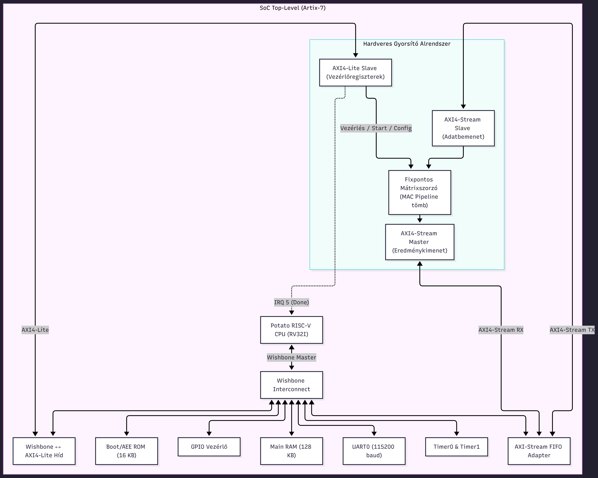
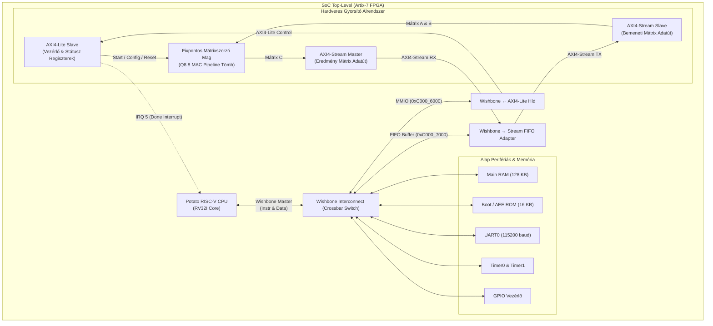

# Rendszerterv és Részletes Specifikáció
## RISC-V Soft-Core + AXI Hardveres Gyorsító

*Készült a diplomamunka Fázis 0 / Sprint 0 mérföldköveként*  
*Célplatform: Xilinx Artix-7 FPGA (`xc7a35tcsg324-1`) · Vivado 2023.2 · VHDL · Bare-metal C*

---

## 1. Rendszerarchitektúra áttekintése

A tervezett rendszer egy egylapkás rendszer (System-on-Chip, SoC), amely egy 32 bites RISC-V processzormagból, belső buszhálózatból, szabványos mikrokontroller perifériákból és egy dedikált, hardveres fixpontos mátrixszorzó gyorsítóból áll.

 Mermaid forráskód (szerkesztéshez)

---

## 2. Memóriatérkép (Address Map)

A Potato processzor 32 bites lineáris címtartományt használ. A memóriatérkép úgy lett kialakítva, hogy a meglévő perifériák mellett a gyorsító alrendszer külön dedikált címmezőt kap:

| Kezdőcím | Végcím | Méret | Eszköz / Modul | Buszinterfész | Leírás |
| :--- | :--- | :--- | :--- | :--- | :--- |
| `0x0000_0000` | `0x0001_FFFF` | 128 KB | Main Memory | Wishbone | Rendszermemória (RAM kód és adat) |
| `0xC000_0000` | `0xC000_0FFF` | 4 KB | Timer 0 | Wishbone | Rendszer időzítő és cikluskövető |
| `0xC000_1000` | `0xC000_1FFF` | 4 KB | Timer 1 | Wishbone | Általános célú időzítő |
| `0xC000_2000` | `0xC000_2FFF` | 4 KB | UART 0 | Wishbone | Soros kommunikáció (115200 8N1) |
| `0xC000_4000` | `0xC000_4FFF` | 4 KB | GPIO 0 | Wishbone | LED-ek, gombok, kapcsolók |
| **`0xC000_6000`** | **`0xC000_60FF`** | **256 B** | **Gyorsító Vezérlés** | **AXI4-Lite** | **Kontroll, státusz és számláló regiszterek** |
| **`0xC000_7000`** | **`0xC000_70FF`** | **256 B** | **Stream FIFO Port** | **AXI4-Lite / WB** | **Streaming TX/RX adatpufferek** |
| `0xFFFF_8000` | `0xFFFF_BFFF` | 16 KB | AEE ROM | Wishbone | Bootloader / indító ROM |
| `0xFFFF_C000` | `0xFFFF_FFFF` | 16 KB | AEE RAM | Wishbone | Bootloader ideiglenes RAM |

---

## 3. Hardveres Gyorsító Specifikáció

### 3.1. Matematikai modell és algoritmus
A gyorsító két négyzetes mátrix szorzatát számítja ki:
$$C = A \times B, \quad \text{ahol } A, B, C \in \mathbb{R}^{N \times N}, \quad N \in \{4, 8, 16\}$$

Egy tetszőleges $C_{i,j}$ elem kiszámítása:
$$C_{i,j} = \sum_{k=0}^{N-1} A_{i,k} \cdot B_{k,j}$$

### 3.2. Fixpontos számábrázolás (Q8.8 formátum)
A lebegőpontos (float) aritmetika helyett a hatékony FPGA erőforrás-kihasználás érdekében **Q8.8-as fixpontos formátumot** alkalmazunk:
- **Szélesség:** 16 bit (előjeles, kettes komplemens).
- **Struktúra:**
  - 1 bit előjel (MSB).
  - 7 bit egész rész.
  - 8 bit törtrész (LSB).
- **Értékkészlet:** $[-128.0 \,;\, +127.99609375]$
- **Legkisebb lépésköz (kvantálási felbontás):** $2^{-8} = 0.00390625$

### 3.3. Túlcsordulás elleni védelem és akkumulátor méretezés
Két 16 bites szám szorzata 32 bites eredményt ad ($Q8.8 \times Q8.8 \rightarrow Q16.16$).  
$N$ darab ilyen szorzat összeadásakor a túlcsordulás megelőzésére legalább $\lceil \log_2(N) \rceil$ többletbit (guard bit) szükséges:
- $N = 4$-nél: $+2$ bit $\rightarrow$ min. 34 bit.
- $N = 8$-nál: $+3$ bit $\rightarrow$ min. 35 bit.
- $N = 16$-nál: $+4$ bit $\rightarrow$ min. 36 bit.

**Döntés:** A belső akkumulátor regisztert **40 bitesre** méretezzük, ami akár $N=256$-os dimenzióig garantálja a túlcsordulásmentes pontos összegzést. A kimeneten telítéses (saturating) kerekítéssel alakítjuk vissza az eredményt az elvárt formátumra.

---

## 4. Buszinterfészek és Regisztertérkép

### 4.1. AXI4-Lite Vezérlőregiszterek (Báziscím: `0xC000_6000`)

| Relatív cím | Regiszter név | Hozzáférés | Reset érték | Leírás |
| :--- | :--- | :---: | :---: | :--- |
| `+0x00` | **`ACCEL_CR`** | R/W | `0x0000_0000` | **Vezérlőregiszter** Bit 0: `START` (1-re írása indítja a számítást, auto-clear) Bit 1: `RESET` (Hardveres gyorsító belső törlése) Bit 2: `IE` (Interrupt Enable: kész állapotkor IRQ generálás) |
| `+0x04` | **`ACCEL_SR`** | R | `0x0000_0000` | **Állapotregiszter** Bit 0: `BUSY` (1 = számítás folyamatban) Bit 1: `DONE` (1 = számítás kész, olvasás vagy új start törli) Bit 2: `ERR_OVERFLOW` (1 = akkumulátor túlcsordulás) |
| `+0x08` | **`ACCEL_DIM`** | R/W | `0x0000_0004` | **Dimenzióregiszter** Bit [7:0]: $N$ értéke (pl. 4, 8, 16) |
| `+0x0C` | **`ACCEL_CYCLES`**| R | `0x0000_0000` | **Cikluskövető számláló** A legutóbbi mátrixszorzás által felhasznált hardveres órajelciklusok száma (cikluspontos benchmark méréshez). |

### 4.2. AXI4-Stream Adatátviteli Interfész
Az adatok bejuttatása és a végeredmény kinyerése folyamatos streaming csatornán történik:
- **`S_AXIS` (Bemeneti stream a gyorsító felé):**
  - `TDATA [31:0]`: Két darab 16 bites Q8.8 adat szavanként tömörítve.
  - `TVALID / TREADY`: Kétirányú handshake (backpressure-tűrés).
  - `TLAST`: Jelzi a mátrix utolsó elemének beérkezését.
- **`M_AXIS` (Kimeneti stream a gyorsítóból):**
  - `TDATA [31:0]`: Két darab kiszámított Q8.8 eredményminta.
  - `TVALID / TREADY`: Handshake jelzés.
  - `TLAST`: Az eredménymátrix utolsó szavának jelzése.

---

## 5. Megszakításkezelés és Debug Terv

1. **Megszakítás (Interrupt):**
   * A gyorsító `DONE` jelzése a Potato processzor **IRQ 5** vonalára van kötve.
   * Kis méretű mátrixoknál ($4 \times 4$) a szoftver poll-ozhatja az `ACCEL_SR` regisztert (minimális szoftveres overhead).
   * Nagyobb mátrixoknál a C kód megszakításkezelővel (WFI – Wait For Interrupt) alvó állapotba küldheti a CPU-t, amíg a hardver dolgozik.
2. **Hardveres Debug (Laboratóriumi felkészülés):**
   * A Vivado projektbe beépítendő egy **Xilinx ILA (Integrated Logic Analyzer)** mag az AXI4-Lite és AXI4-Stream buszok megfigyelésére.
   * Triggerek: `START` impulzus, `TLAST` jel, `IRQ` kiváltódás.

---

## 6. Szoftveres Verifikációs és Benchmark Stratégia

A Sprint 10 és 11 során a következő validációs programcsomag fut le:

1. **Numerikus helyesség ellenőrzése:**
   * Python referenciaszkript generál véletlen és teszt (pl. egységmátrix, ortogonális mátrix) mintákat.
   * A C bare-metal szoftver kiszámítja a szorzatot szoftveresen (3 beágyazott ciklussal), majd kiszámíttatja a HW gyorsítóval is.
   * Automatikus bit-pontos összehasonlítás.
2. **Teljesítménymérés (Speedup):**
   * Futási idő ciklusszámban: $T_{sw}$ (CPU Timer0-val mérve) és $T_{hw}$ (`ACCEL_CYCLES` regiszterből olvasva).
   * Gyorsulási tényező: 
     $$\text{Speedup} = \frac{T_{sw}}{T_{hw}}$$
   * Várt gyorsulás: a Potato mag szoftveres szorzó hiányában lassan szoroz (bitenkét léptetve), így a dedikált MAC tömbbel **10× – 50×-es gyorsulás** várható!
