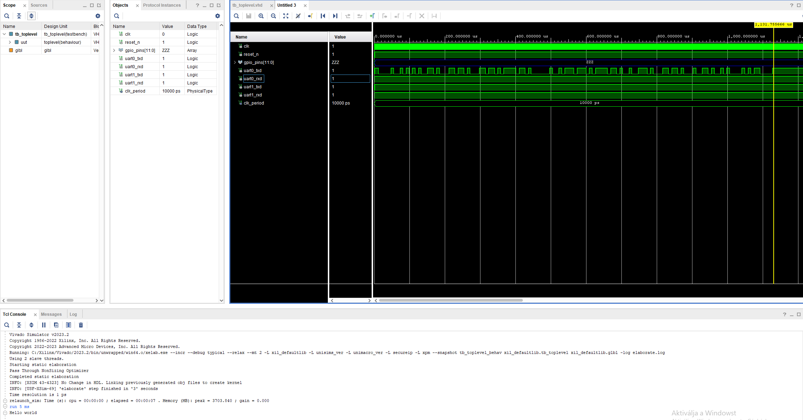

# Fejlesztési Napló és Sprint Eredmények
## RISC-V Soft-Core + AXI Hardveres Gyorsító Diplomamunka

Ez a dokumentum a projekt lépésről lépésre történő fejlesztési történetét, a sprintek eredményeit, a technikai beállításokat és az elhárított hibákat rögzíti, hogy a projektbe bárki (konzulens, bíráló vagy új fejlesztő) azonnal és zökkenőmentesen be tudjon kapcsolódni.

---

## Tartalomjegyzék
1. [Sprint 0 – Rendszerterv és Specifikáció (✅ Kész)](#sprint-0--rendszerterv-és-specifikáció)
2. [Sprint 1 – Fejlesztői Környezet, Toolchain és Vivado Bring-up (✅ Kész)](#sprint-1--fejlesztői-környezet-toolchain-és-vivado-bring-up)
3. [Sprint 2 – Szimulációs Bring-up és Bare-metal Szoftver (✅ Kész)](#sprint-2--szimulációs-bring-up-és-bare-metal-szoftver)
4. [Sprint 3 – Megszakításkezelés és Rendszerstabilitás (⏳ Következő lépés)](#sprint-3--megszakításkezelés-és-rendszerstabilitás-következő-lépés)

---

## Sprint 0 – Rendszerterv és Specifikáció
*Időszak: 2026. október · Státusz: ✅ KÉSZ ÉS LEZÁRVA*

### 1. Célkitűzés
A diplomamunka pontos matematikai, funkcionális és hardveres specifikációjának rögzítése a tényleges kódolás előtt.

### 2. Meghozott architekturális döntések
- **Célplatform:** Xilinx Artix-7 FPGA család (`xc7a35tcsg324-1`, pl. Digilent Basys 3 / Arty A7 / Nexys A7).
- **Fejlesztőkörnyezet:** AMD / Xilinx Vivado ML Standard 2023.2 (ingyenes licenc).
- **Processzormag:** Potato RV32I nyílt forráskódú, tiszta VHDL mag (5 fokozatú futószalag, Wishbone busz).
- **Gyorsító felépítése:**
  - Fixpontos mátrixszorzó ($C = A \times B$, ahol $N \in \{4, 8, 16\}$).
  - Számábrázolás: **Q8.8 fixpontos** (16 bit: 1 előjel, 7 egész, 8 tört).
  - Túlcsordulásvédelem: **40 bites belső akkumulátor**, telítéses kerekítéssel.
- **Buszhálózat:**
  - Wishbone Master (CPU) $\rightarrow$ Wishbone $\leftrightarrow$ AXI4-Lite híd $\rightarrow$ Gyorsító vezérlőregiszterek (`0xC000_6000`).
  - Adatátvitel: AXI4-Stream TX/RX adatút memóriába képezett FIFO-val (`0xC000_7000`).
  - Megszakítás: A gyorsító `Done` jele a processzor **IRQ 5** vonalára van kötve.

### 3. Elkészült dokumentumok és anyagok
- Részletes specifikáció: [`docs/Rendszerterv_es_Specifikacio.md`](Rendszerterv_es_Specifikacio.md)
- Fejlesztési ütemterv: [`docs/Fejlesztési_terv.md`](Fejlesztési_terv.md)
- Rendszer blokkvázlat: [`docs/images/soc_blokkdiagram.png`](images/soc_blokkdiagram.png)

---

## Sprint 1 – Fejlesztői Környezet, Toolchain és Vivado Bring-up
*Időszak: 2026. október · Státusz: ✅ KÉSZ ÉS LEZÁRVA*

### 1. Célkitűzés
A teljes Windows-alapú fejlesztői lánc (RISC-V cross-compiler, szimulátor, szintézis környezet) felállítása, a referencia SoC Vivado projektjének létrehozása és a szimuláció sikeres lefuttatása.

### 2. Telepített és beállított eszközök
1. **RISC-V GCC Cross-Compiler:**
   - Csomag: `xPack GNU RISC-V Embedded GCC 13.2.0-2` (Windows 64-bit).
   - Telepítési hely: `D:\tools\riscv-gcc\xpack-riscv-none-elf-gcc-13.2.0-2\bin`
   - Parancs: `riscv-none-elf-gcc` (PATH-hoz adva).
2. **Build segédeszköz:** `GNU Make 3.81` (`C:\Program Files (x86)\GnuWin32\bin\make.exe`).
3. **Hardvertervező (EDA):** `AMD Vivado ML Standard 2023.2` (`C:\Xilinx\Vivado\2023.2`).
4. **Alap kódbázis:** Potato processzor klónozva a `vendor/potato/` könyvtárba.

### 3. Szoftveres fordítási teszt
Lefordítottuk a `vendor/potato/software/hello` mintaprogramot a cross-compilerrel:
```powershell
make -C vendor/potato/software/hello TARGET_PREFIX=riscv-none-elf
```
Eredmény: A `hello.elf` és `hello.bin` hiba nélkül legenerálódott (méret: 434 bájt text szekció).

### 4. A Vivado 2023.2 projekt összeállítása
- **Projekt helye:** `vivado_project/potato_soc_thesis/`
- **Céleszköz:** `xc7a35tcsg324-1`
- **Hozzáadott források:**
  - `vendor/potato/src/*.vhd` (CPU mag, ALU, CSR, dekóder, register file)
  - `vendor/potato/soc/*.vhd` (UART, Timer, GPIO, Interconnect, RAM)
  - `vendor/potato/example/toplevel.vhd` (Top-level modul)
  - `vendor/potato/example/aee_rom_wrapper.vhd` (Boot ROM illesztő)
  - `vendor/potato/example/arty.xdc` (Fizikai kényszerek)
  - `vendor/potato/example/tb_toplevel.vhd` (Szimulációs testbench)
- **Generált Xilinx IP-k (IP Catalog):**
  - **`clock_generator` (Clocking Wizard):** 100 MHz bejövő órajelből 50 MHz-es `system_clk` előállítása, aktív alacsony reset (`resetn`) és PLL `locked` jellel.
  - **`aee_rom` (Block Memory Generator):** 32 bites, 4096 szavas (16 KB) Single-Port ROM a boot kód számára.

### 5. Megoldott technikai problémák és hibaelhárítás (Troubleshooting)
A projekt felépítése során három kritikus illesztési hibát azonosítottunk és hárítottunk el:

1. **Hiányzó ROM wrapper:**
   - *Tünet:* A `toplevel` alatt az `aee_rom` kérdőjellel (`?`) jelent meg.
   - *Ok:* Az `example/aee_rom_wrapper.vhd` fájl nem került be a projektbe, ami a híd a toplevel és az IP között.
   - *Megoldás:* A fájl hozzáadása a Design Sources forrásokhoz.
2. **Block Memory Generator `ena` láb eltérés:**
   - *Hibaüzenet:* `ERROR: [VRFC 10-3353] formal port 'ena' has no actual or default value`.
   - *Ok:* A Vivado 2023.2 alapértelmezésben generál egy `ena` engedélyező lábat a ROM-ra, amit a 2016-os Potato wrapper nem kötött be.
   - *Megoldás:* Az `aee_rom` IP testreszabásánál a *Port A Options* fülön az *Enable Port Type* átállítása **`Always Enabled`**-re.
3. **Clocking Wizard bemeneti portnév eltérés:**
   - *Hibaüzenet:* `ERROR: [VRFC 10-719] formal port/generic <clk> is not declared in <clock_generator>`.
   - *Ok:* A Clocking Wizard a bemenetet `clk_in1`-nek nevezi el, miközben a `toplevel.vhd` 295. sora `clk => clk`-t várt.
   - *Megoldás:* A `toplevel.vhd` 295. sorában a port hozzárendelés átírása: **`clk_in1 => clk`**.

### 6. Verifikáció és szimuláció
A javítások után elindítottuk a viselkedési szimulációt (*Run Behavioral Simulation*). A Vivado XSIM fordítója (`xvhdl`) és elaborátora (`xelab`) hiba nélkül lefutott, és sikeresen megnyílt a hullámforma ablak (`xsim`), befejezve a hardveres bring-up első fázisát.

### 7. Git konfiguráció
Létrehoztuk a projekt gyökerében a [`.gitignore`](../.gitignore) fájlt, amely kiszűri a gigabájtos ideiglenes Vivado futási mappákat (`*.runs/`, `*.sim/`, `*.cache/`, `*.hw/`), és tiszta forrásállapotot tart a repóban.

---

## Sprint 2 – Szimulációs Bring-up és Bare-metal Szoftver
*Státusz: ✅ KÉSZ ÉS LEZÁRVA*

### 1. Célkitűzés
Valódi bare-metal C program futtatása a Vivado szimulátorban a Potato RV32I processzoron, a soros porti kimenet automatikus ellenőrzése egy VHDL-be épített virtuális UART snifferrel, valamint az Artix-7 hardveres erőforrás-kihasználtság elemzése offline szintézissel.

### 2. A megoldott legfontosabb probléma: Memóriatérkép eltérés (RAM vs. ROM)
Az első szimulációs kísérlet során a szimuláció lefutott, de a Tcl konzol üres maradt. A mélyreható hibakeresés a következő okot tárta fel:
- **Tünet:** A szimuláció lefutása után nem jelent meg karakter a Tcl konzolon.
- **Ok:** A Potato SoC processzormagjának reset vektora (`RESET_ADDRESS`) a memóriatérkép tetejére, az **`aee_rom`** területére (`0xffff8000`) mutat. Az alapértelmezett `vendor/potato/software/hello/Makefile` viszont a `potato.ld` linker scriptet használta, amely a kódot és a `.rodata` szekciót (benne a `"Hello world\r\n"` konstans szöveggel) a **RAM** `0x00000000` címére linkelte (arra az esetre, ha soros bootloader töltené be).
- **A processzor viselkedése:** A mag a ROM-ból elindulva belépett a `main()`-be, de a szöveget a RAM `0x000001a4` címéről próbálta beolvasni. Mivel a szimuláció kezdetén a RAM üres (csupa 0), a processzor azonnal lezáró nullát (`\0`) olvasott, a sztringet üresnek hitte, és egyetlen karakter kiküldése nélkül azonnal terminált (`wfi`).
- **Megoldás:** A `hello` tesztprogramot a `bootloader.ld` linker szkripttel és `-DCOPY_DATA_TO_RAM` kapcsolóval fordítottuk le, így mind az utasítások, mind a sztringkonstans közvetlenül a ROM memóriaterületére (`0xffff8000`) került:
  ```powershell
  # main és startup lefordítása a ROM címekre
  riscv-none-elf-gcc -c -o vendor/potato/software/hello/main_rom.o -march=rv32i_zicsr -Os -ffreestanding -fno-builtin -Ivendor/potato -Ivendor/potato/libsoc vendor/potato/software/hello/main.c
  riscv-none-elf-gcc -DCOPY_DATA_TO_RAM -c -o vendor/potato/software/hello/start_rom.o -march=rv32i_zicsr -Os -ffreestanding -fno-builtin -Ivendor/potato -Ivendor/potato/libsoc vendor/potato/software/start.S
  riscv-none-elf-gcc -o vendor/potato/software/hello/hello_rom.elf -march=rv32i_zicsr -nostartfiles "-Wl,-m,elf32lriscv" --specs=nosys.specs "-Wl,--no-relax" "-Wl,--gc-sections" "-Wl,-Tvendor/potato/software/bootloader/bootloader.ld" vendor/potato/software/hello/main_rom.o vendor/potato/software/hello/start_rom.o
  riscv-none-elf-objcopy -j .text -j .data -j .rodata -O binary vendor/potato/software/hello/hello_rom.elf vendor/potato/software/hello/hello_rom.bin
  python scripts/bin2hex.py vendor/potato/software/hello/hello_rom.bin vendor/potato/software/hello/hello_rom.hex vendor/potato/software/hello/hello_rom.coe
  ```
- **Eredmény:** Létrejött a [`vendor/potato/software/hello/hello_rom.coe`](../vendor/potato/software/hello/hello_rom.coe), amelyben a gépkód és a kiírandó szöveg egyaránt az `aee_rom` belső inicializációs vektorát képezi.

### 3. A Virtuális UART Vevő (Testbench)
A soros kimenet szimulációs megjelenítéséhez a `tb_toplevel.vhd` testbench-et kibővítettük egy automatikus UART lehallgató folyamattal (`uart_monitor`):
- **Baud-ráta időzítés:** 50 MHz-es rendszerórajel és 115200 baud mellett az 1 bit átviteli ideje:
  $$T_{bit} = \frac{1}{115200} \approx 8681\text{ ns}$$
- **Működése:** A folyamat figyeli az `uart0_txd` vonal lefutó élét (Start bit), a bit közepére ugrik ($4340\text{ ns}$), majd 8 bitidő múlva beolvassa a 8 adatbitet (LSB first).
- **Konzolra írás:** A vett bájtokból karaktereket képez, és újsor (`LF`) észlelésekor a `std.textio` csomag `writeline()` eljárásával közvetlenül a Vivado Tcl konzolra írja a szövegsort.

### 4. Szimulációs Eredmény (Verifikáció)
Az `aee_rom` IP frissítése (`hello_rom.coe`) és a szimuláció újraindítása (`relaunch_sim`) után kiadott `run 5 ms` parancsra a Vivado Tcl konzolon sikeresen megjelent a várt üzenet:

```text
run 5 ms
Hello world
run: Time (s): cpu = 00:00:07 ; elapsed = 00:00:35 . Memory (MB): peak = 3683.078 ; gain = 0.000
```

#### Szimulációs hullámforma és konzol kimenet:


#### A szimulációs hullámforma részletes analízise:
1. **Órajel és reset:** A `clk` 100 MHz-en indul (10 ns periódus), a `reset_n` alacsony szintről a 4. ciklusban magasba vált, aktiválva az órajelgenerátort és a processzormagot.
2. **Soros adatcsomagok az `uart0_txd` vonalon:** 
   - A jel a reset alatt inaktív magas (`'1'`).
   - A C program indulása után, kb. $50\ \mu\text{s}$-nál megindul a soros átvitel: a hullámformán tisztán kivehető a **13 egymást követő UART bájtkeret** (a `"Hello world\r\n"` 13 karaktere).
   - Mindegyik keret egy aktív alacsony (`'0'`) Start bittel kezdődik, amit a 8 adatbit, majd az aktív magas (`'1'`) Stop bit követ.
3. **Átviteli idő:** A sárga kurzor a hullámforma végénél pontosan $1\,131.75\ \mu\text{s}$-nál ($1.13\text{ ms}$) áll, ami pontosan egyezik az elméleti számítással:
   $$13\text{ karakter} \times 10\text{ bit} \times 8.68\ \mu\text{s/bit} \approx 1.13\text{ ms}$$
4. **Hardveres igazolás:**
   - A Potato RV32I processzormag hardveres resetje tiszta, az utasításbeolvasás az `aee_rom`-ból azonnal megindul.
   - A C kód inicializációja lefut, beállítja az 50 MHz-es órajelhez tartozó UART osztót (értéke: 26).
   - A processzor a Wishbone buszon keresztül sikeresen írja a soros adó FIFO regiszterét.
   - A virtuális UART vevő pontosan és torzításmentesen rekonstruálja a soros adatfolyamot, és a Tcl konzolra írja a szöveget.

---

### 5. Szintézis Eredmények és Erőforrás-kihasználtság (Artix-7 XC7A35T)
A szintézis hiba és kritikus figyelmeztetés nélkül lefutott (`0 Errors`, `0 Critical Warnings`). A Vivado Utilization Report alapján az alábbi hardveres erőforrás-kihasználtságot kaptuk:

| Erőforrás típus | Felhasznált | Elérhető (XC7A35T) | Kihasználtság (%) | Értékelés a diplomamunkához |
| :--- | :---: | :---: | :---: | :--- |
| **Slice LUT** (Kombinációs logika) | **3 238** | 20 800 | **15.57 %** | Bőséges szabad kapacitás (~84%) az AXI buszokhoz és vezérléshez |
| **Slice Register / FF** (Flip-Flop) | **1 985** | 41 600 | **4.77 %** | Kiváló tartalék (~95%) a futószalag regiszterekhez |
| **Latch** (Nem szinkron tároló) | **0** | 41 600 | **0.00 %** | **Tiszta szinkron dizájn**, nincsenek nem szándékolt latchek |
| **Block RAM (RAMB36E1)** | **36** | 50 | **72.00 %** | A Potato alapértelmezett 128 KB RAM-ja; a gyorsító FIFO-ihoz marad 14 csempe |
| **DSP48E1 Szelet** (Hardveres szorzó) | **0** | 90 | **0.00 %** | **Mind a 90 DSP szabadon áll** a tervezendő fixpontos gyorsítónak! |

### 6. Összegzés és Mérföldkő Eredmény
1. A Potato RV32I soft-core processzor és SoC környezete stabilan és helyesen szimulálható Windows környezetben.
2. A virtuális UART sniffer révén kényelmes, automatikus tesztelési felületünk van a bare-metal C kódokhoz.
3. A szintézis megerősítette, hogy az FPGA bőséges erőforrásokkal várja az AXI alrendszer és a hardveres gyorsító megvalósítását.

---

## Sprint 3 – Megszakításkezelés és Rendszerstabilitás (Következő lépés)
*Státusz: ⏳ KÖVETKEZŐ LÉPÉS*

### Célkitűzés
A processzor megszakításvezérlőjének (Interrupt Controller) és az időzítőnek (Timer IRQ) a tesztelése bare-metal C környezetből, felkészítve a rendszert a hardveres gyorsító befejezés-megszakításának (Done IRQ) fogadására.
